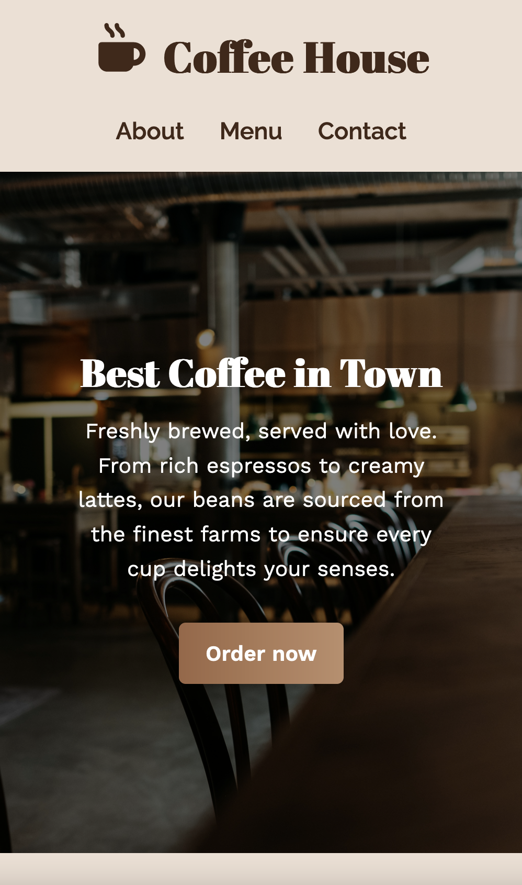

# Coffee Shop Landing Page

A responsive landing page for a coffee shop, built with HTML, CSS, and JS.  

**Live Demo:** [https://danny-codes.github.io/portfolio-projects/coffeeshop-landing/index.html](https://danny-codes.github.io/portfolio-projects/coffeeshop-landing/index.html)  

## Features
- Responsive layout for desktop and mobile
- Contact form with Formspree AJAX submission
- Smooth button hover effects and clean UI
- Google Fonts integration

## Screenshots
**Desktop view**

**Mobile view**

## How to use
- Clone repo
- Open `index.html` in a browser
- Or deploy using GitHub Pages